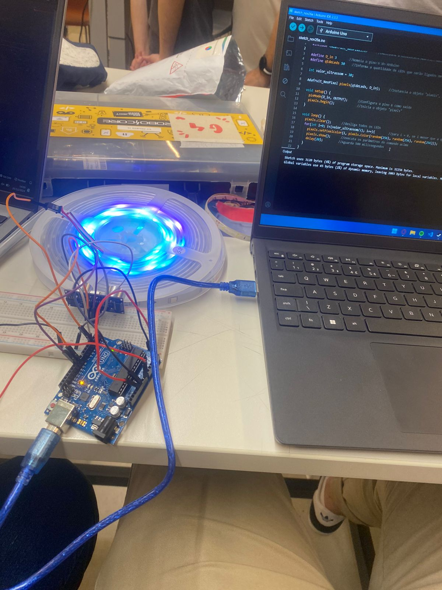

# Portfólio Pessoal

Este é o meu portfólio pessoal, criado para apresentar minhas habilidades, projetos e informações de contato. O site é uma demonstração simples das tecnologias que estou aprendendo e desenvolvendo como estudante de Ciência da Computação.
## Como Usar

1. Clone este repositório ou baixe os arquivos para o seu computador.
2. Abra o arquivo `index.html` no seu navegador para visualizar o portfólio.
3. O "Modo Escuro" pode ser ativado clicando no botão **"Ativar Modo Escuro"** no rodapé da página.

## Descrição do Projeto

Este é o repositório do meu portfólio, onde apresento alguns dos projetos que desenvolvi. O objetivo deste portfólio é destacar minhas habilidades e demonstrar as tecnologias que estou aprendendo e aplicando no meu processo de desenvolvimento.

## Descrição do Projeto

Este portfólio contém uma lista de projetos nos quais trabalhei, com detalhes e imagens para ilustrar cada um. Além disso, há uma opção para alternar para o **Modo Escuro** para personalizar a visualização do site.

## Projetos:

### Projeto 1: **Aurota - Playable City**

- **Descrição**: O projeto "Aurora" é uma cidade jogável com o objetivo de melhorar a iluminação do bairro Recife, ao mesmo tempo em que proporciona uma maneira lúdica de viver a cidade.
  
### Projeto 2: **CRUD - Gerenciador de Treinos e Competições**

- **Descrição**: Um projeto em Python, cujo objetivo é criar um gerenciador de treinos e competições de corrida. Permite cadastrar e gerenciar treinos e eventos relacionados.

### Projeto 3: **Site Pessoal - Portfólio**
- **Descrição**: Um portfólio pessoal desenvolvido para aprimorar meus conhecimentos em **HTML**, **CSS** e **JavaScript**. A ideia é criar uma página que destaque minhas habilidades e projetos.

### Estrutura do Projeto
- **index.html**: Arquivo principal que contém o portfólio e os links para os projetos.
- **extra.css**: Arquivo CSS com o estilo visual do portfólio.
- **arquivo.js**: Script JavaScript que permite a alternância para o "Modo Escuro".
- **Imagens**: Imagens dos projetos que ilustram cada um deles (como `projetos.jpeg` e `menu.png`).

### Instruções para o Modo Escuro

A funcionalidade "Modo Escuro" permite que o usuário altere a visualização da página para um tema escuro, proporcionando um modo de leitura mais confortável durante a noite. Para ativar o modo escuro, basta clicar no botão **"Ativar Modo Escuro"** no rodapé da página.
Este portfólio possui várias seções, incluindo:

- **Sobre mim**: Informações pessoais e motivação para a área de Ciência da Computação.
- **Habilidades**: Linguagens de programação e tecnologias que estou aprendendo.
- **Projetos**: Um link para a página onde você pode ver mais detalhes sobre os projetos que desenvolvi.
- **Contato**: Informações para entrar em contato comigo via e-mail.

O site também possui uma opção para ativar o "Modo Escuro", usando JavaScript para alterar o estilo visual da página.

## Como Usar

1. Clone este repositório ou baixe os arquivos para o seu computador.
2. Abra o arquivo 'index.html' no seu navegador para visualizar o portfólio.
3. O "Modo Escuro" pode ser ativado clicando no botão **"Ativar Modo Escuro"** no rodapé da página.

## Tecnologias Utilizadas

- **HTML**: Para estruturar o conteúdo da página.
- **CSS**: Para estilizar o portfólio.
- **JavaScript**: Para adicionar interatividade, como o botão de "Modo Escuro".
- **Imagem**: Uma imagem pessoal foi adicionada na seção "Sobre Mim".

# Alternância entre Modo Claro e Modo Escuro

Este é um projeto simples que implementa a funcionalidade de alternância entre **Modo Claro** e **Modo Escuro** em uma página web, utilizando JavaScript. O objetivo deste projeto é adicionar interatividade e personalização de tema ao site.

## Descrição do Projeto

Este script permite ao usuário alternar entre dois modos de visualização na página: **Modo Claro** e **Modo Escuro**. Quando o usuário clica no botão de alternância, o tema da página muda dinamicamente, aplicando uma classe CSS que altera as cores de fundo e do texto.

### Funcionalidades

- **Modo Escuro**: Altera a aparência da página para um tema escuro, proporcionando uma melhor experiência de leitura em ambientes com pouca luz.
- **Modo Claro**: Retorna à aparência padrão da página, com fundo claro e texto escuro.
- **Alternância**: O botão de alternância muda seu texto de "Ativar Modo Escuro" para "Ativar Modo Claro" dependendo do estado atual do tema.

## Como Usar

1. Implemente o script JavaScript no seu arquivo HTML.
2. Adicione um botão com o ID `modo-toggle` e um corpo de página com o conteúdo que deseja alternar entre os modos.
3. Ao clicar no botão, o tema da página será alterado de acordo com o estado atual.

### Instruções para o Modo Escuro
- **JavaScript**:
    - O script captura o botão de alternância e o corpo da página utilizando `getElementById` e `document.body`.
    - Uma função de `click` alterna a classe `modo-escuro` no corpo da página.
    - O texto do botão é alterado dinamicamente com base no estado atual da classe `modo-escuro`.

## Como Contribuir

Se desejar fazer sugestões ou melhorias neste portfólio, fique à vontade para abrir uma *issue* ou submeter um *pull request*.
